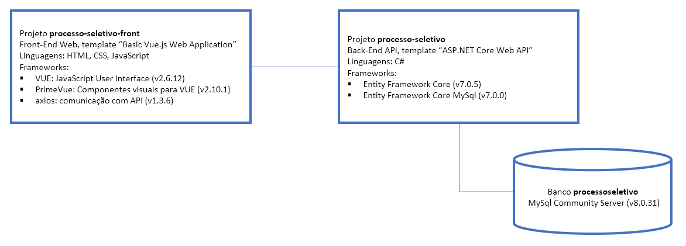

# processo-seletivo
Aplicação de avaliação ténica para o cargo de desenvolvedor na Hepta.
A aplicação é um front-end Web para visualização e gerenciamento (CRUD) em uma listagem de funcionários armazenada em banco de dados:

## Guia de Como Executar a Aplicação
Este guia descreve os passos necessários para executar a aplicação e fornecer informações adicionais sobre o projeto. Certifique-se de ter cumprido todos os requisitos antes de começar.

## Requisitos de Software
Antes de prosseguir com a execução da aplicação, verifique se você possui os seguintes pré-requisitos de software instalados:

Node.js v16.16: Certifique-se de ter o Node.js v16.16 instalado em sua máquina. Você pode baixar o Node.js na página oficial em https://nodejs.org e seguir as instruções de instalação fornecidas.

Vue 2: Framework JavaScript para criação de interfaces de usuário. Certifique-se de ter o Vue 2 instalado em sua máquina. Você pode encontrar o Vue 2 no site oficial do Vue.js em [https://vuejs.org](https://vuejs.org). Siga as instruções de instalação fornecidas na documentação oficial do Vue 2.

Instalar Vue 2:

Abra o terminal ou prompt de comando e execute os seguintes comandos:

bash

npm install -g vue@^2

npm install -g @vue/cli

npm install -g @vue/cli-service

Visual Studio Code: Um editor de código fonte popular e gratuito, desenvolvido pela Microsoft. Você pode baixar o Visual Studio Code em https://code.visualstudio.com e seguir as instruções de instalação específicas para o seu sistema operacional.

Certifique-se de que todas as dependências estejam instaladas corretamente antes de prosseguir para a próxima seção.

## Configuração
As etapas de configuração são as seguintes:

Clone este repositório para o seu ambiente local:

bash

git clone https://github.com/Alexlr10/Processo-Seletivo-Hepta-front.git

Acesse o diretório do projeto:

bash

cd processo-seletivo-front

Instale as dependências do projeto:

bash

npm install

Executando a Aplicação

Certifique-se de que você está no diretório do projeto no terminal.

Execute o seguinte comando para iniciar a aplicação:

bash

npm run serve

Aguarde até que a aplicação seja compilada e iniciada. Você verá uma mensagem indicando o endereço local 
em que a aplicação está sendo executada.

Agora você pode acessar a aplicação em seu navegador, utilizando o endereço local fornecido.

## Considerações Finais
Este arquivo HOWTO.md forneceu instruções para executar a aplicação. Como mencionado anteriormente, este projeto não possui testes disponíveis.

Certifique-se de consultar a documentação do projeto para obter mais detalhes sobre recursos e funcionalidades avançadas.

